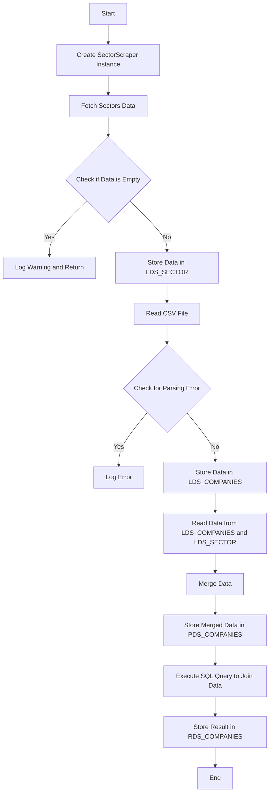
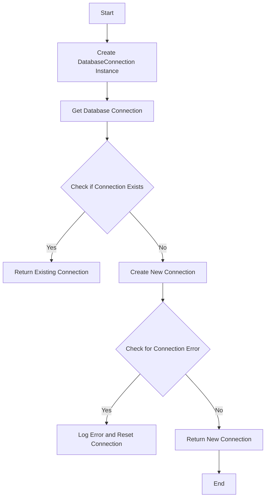
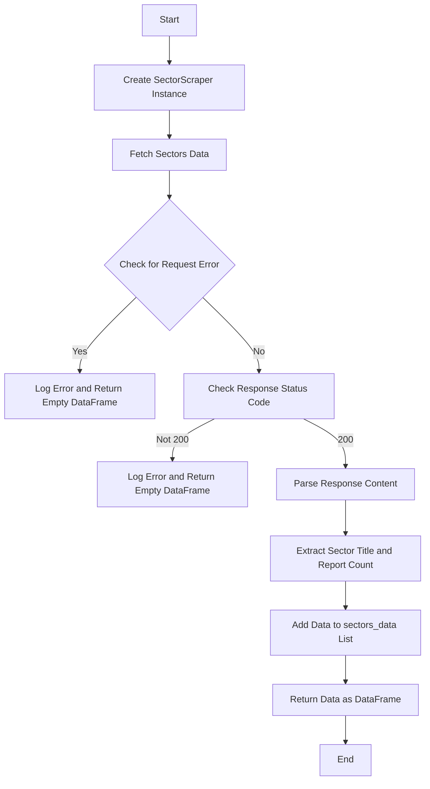
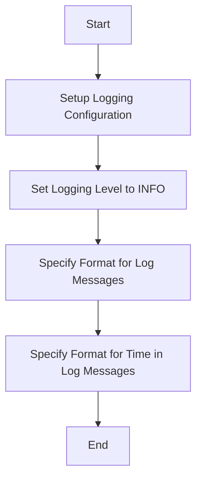
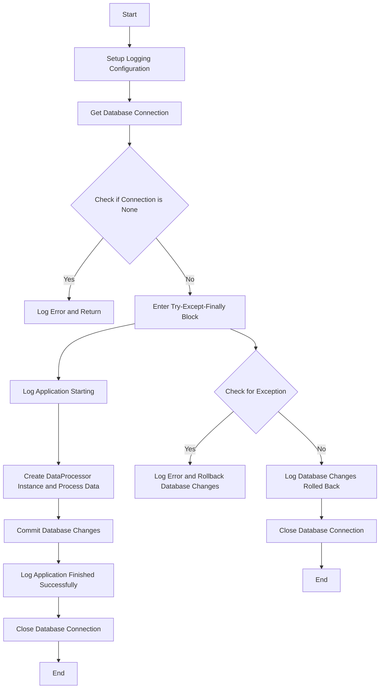
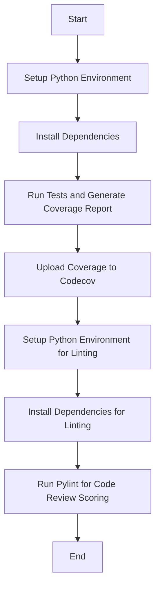

## Data Processing Explanation

The provided Python code is part of a module named `data_processor.py`, which contains a class `DataProcessor` for processing data from CSV files and web scrapers. The class is initialized with a file path to a CSV file.

The `DataProcessor` class has a method `process_data(self, conn)`, which takes a database connection as an argument. This method is responsible for processing the data from the CSV file and a web scraper, and storing it in the database.

Inside this method, an instance of `SectorScraper` is created with a URL to a website. The `fetch_sectors_data()` method of `SectorScraper` is called to scrape sector data from the website.

The scraped data is then checked if it's empty. If it is, a warning is logged and the method returns. If not, the data is reset, renamed, and stored in the database table `LDS_SECTOR`.

The method then attempts to read the CSV file provided during the initialization of the `DataProcessor` class. The data from the CSV file is stored in the database table `LDS_COMPANIES`. If there's a parsing error while reading the CSV file, an error is logged.

The method then reads data from the `LDS_COMPANIES` and `LDS_SECTOR` tables, merges them, and stores the merged data in the `PDS_COMPANIES` table.

Finally, the method executes a SQL query to join data from the `PDS_COMPANIES` and `LDS_SECTOR` tables, and stores the result in the `RDS_COMPANIES` table.

In summary, this code is responsible for scraping data from a website, reading data from a CSV file, processing and merging the data, and storing the results in a database.

## Data Processing Flow Diagram

Here is a Mermaid diagram to visually represent the flow of data processing:

## Database Connection Explanation

The provided Python code is part of a module named `database_connection.py`, which contains a singleton class `DatabaseConnection` for managing database connections. This class ensures that only one connection is active at a time and provides a consistent interface for fetching the current database connection.

The `DatabaseConnection` class uses the `__new__` method to control its instantiation. If an instance of the class does not exist, it creates a new one. This ensures that only one instance of the `DatabaseConnection` class exists at any given time, adhering to the singleton design pattern.

The class also has a class method `get_connection(cls)`, which returns the current database connection. If no connection exists, it creates a new one. This method uses the `sqlite3.connect` function to establish a connection to the SQLite database.

If there's an error while creating the database connection, the error is logged and the `_connection` class variable is reset to `None`. The exception is then re-raised to be potentially handled by the caller.

In summary, this code is responsible for managing database connections in a way that ensures only one connection is active at a time. It provides a consistent interface for fetching the current database connection and handles potential errors that might occur while establishing the connection.

## Database Connection Flow Diagram

Here is a Mermaid diagram to visually represent the flow of data processing:

## Sector Scraper Explanation

The provided Python code is part of a module named `sector_scraper.py`, which contains a class `SectorScraper` for scraping sector data from a specified URL. The class is designed to fetch sector-specific information from a given webpage, parse the fetched HTML content using BeautifulSoup, and return the data in a structured pandas DataFrame format.

The `SectorScraper` class is initialized with a URL to scrape. It also has an instance variable `sectors_data` which is a list that will hold the scraped data.

The class has a method `fetch_sectors_data(self)`, which is responsible for fetching the sector data from the website and returning it as a DataFrame.

Inside this method, a GET request is sent to the URL with a specified timeout. If an error occurs while fetching the data, an error is logged and an empty DataFrame is returned.

If the response status code is not 200 (OK), an error is logged and an empty DataFrame is returned.

The response content is then parsed with BeautifulSoup. The sector title and report count are extracted for each relevant div element. If the div elements for sector title and report count are found, they are added to the `sectors_data` list.

Finally, the method logs that the sector data has been successfully fetched and parsed, and returns the data as a DataFrame.

In summary, this code is responsible for scraping sector data from a website, parsing the fetched HTML content, and returning the data in a structured pandas DataFrame format. It handles potential HTTP errors and logs important events to facilitate debugging and monitoring of the scraping process.

## Sector Scraper Flow Diagram

Here is a Mermaid diagram to visually represent the flow of data processing:

## Log Configuration Explanation

The provided Python code is part of a module named `log_config.py`, which is responsible for setting up the basic configuration for logging in a Python application. The module contains a single function `setup_logging()`, which sets the logging level and the format for the log messages.

The `setup_logging()` function uses the `basicConfig` method from the `logging` module to set up the basic configuration for logging. The `level` parameter is set to `logging.INFO`, which means that log messages with a severity level of INFO, WARNING, ERROR, and CRITICAL will be logged. DEBUG messages will not be logged because they have a lower priority than INFO.

The `format` parameter is set to a string that specifies the format of the log messages. The format string includes placeholders for the time of logging (`%(asctime)s`), the severity level of the message (`%(levelname)s`), the name of the logger (`%(name)s`), and the log message itself (`%(message)s`).

The `datefmt` parameter is set to a string that specifies the format of the time in the log messages. The time is formatted as 'Year-Month-Day Hour:Minute:Second'.

In summary, this code is responsible for setting up the basic configuration for logging in a Python application. It sets the logging level to INFO, specifies the format for the log messages, and does not return anything.

## Log Configuration Flow Diagram

Here is a Mermaid diagram to visually represent the flow of data processing:

## Main Script Explanation

The provided Python code is part of a script named `main.py`, which serves as the entry point of the application. The script begins by importing necessary modules and setting up the logging configuration using the `setup_logging()` function from the `log_config` module.

The main function of the script is `main()`, which orchestrates the flow of the application. It starts by obtaining a database connection using the `get_connection()` method of the `DatabaseConnection` class.

If the database connection is `None`, an error is logged and the function returns immediately.

The function then enters a try-except-finally block. In the try block, it logs that the application is starting, creates a `DataProcessor` instance, and processes the data using the `process_data(conn)` method. After the data processing, it commits the changes to the database and logs that the application finished successfully.

If an exception occurs during the data processing, the except block logs the error, rolls back the database changes, and logs that the changes were rolled back.

Finally, the function closes the database connection and logs that the connection was closed.

The script ends with a conditional statement that checks if the script is being run directly (not imported). If it is, it calls the `main()` function.

In summary, this script is responsible for orchestrating the flow of the application. It sets up the logging configuration, gets a database connection, processes data, handles potential errors, and manages the database connection.

## Main Script Flow Diagram

Here is a Mermaid diagram to visually represent the flow of data processing:

## GitHub Actions Workflow Explanation

The provided YAML code is a GitHub Actions workflow file named `workflow.yml`. This workflow is designed to automate the process of testing, coverage reporting, and linting for a Python project whenever a push or pull request event occurs.

The workflow is divided into two jobs: `test_and_coverage` and `lint`. 

The `test_and_coverage` job is responsible for setting up a Python environment, installing dependencies, running tests, generating a coverage report, and uploading the coverage report to Codecov. 

The `lint` job is responsible for setting up a Python environment, installing dependencies, and running Pylint for code review scoring and linting. This job depends on the `test_and_coverage` job, meaning it will only run after `test_and_coverage` has completed successfully.

In summary, this GitHub Actions workflow automates the process of testing, coverage reporting, and linting for a Python project. It ensures that these tasks are performed consistently and automatically, helping to maintain the quality of the codebase.

## GitHub Actions Workflow Diagram

Here is a Mermaid diagram to visually represent the flow of the GitHub Actions workflow:

